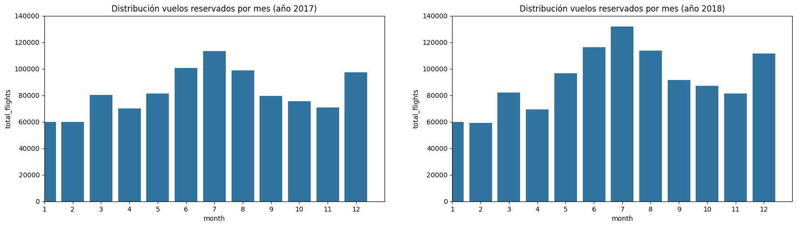
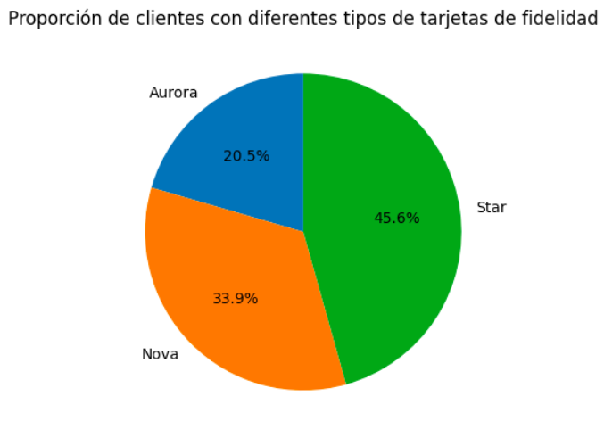

# Programa de lealtad de una aerolínea

## Objetivo 
El objetivo de este proyecto es analizar el comportamiento de los clientes dentro de un programa de lealtad de una `aerolínea`. 

## Marco general de los datos:
- los clientes son todos Canadienses
- las reservas analizadas de estos clientes se han producido durante el 2017 y 2018

## Estructura del análisis del comportamiento de los clientes:
- Fase 1: Exploración y limpieza de los datos
- Fase 2: Visualización
- Fase 3: Evaluación de diferencias en reservas de vuelos por nivel educativo

## Principales insights:

- Los meses con más reservas: `época de verano (junio, julio, agosto) y el mes de diciembre`. El primer trimestre tiene menos reservas:

- Proporción de los clientes con su tarjeta de fidelidad:

- Lo más frecuente es que los clientes reserven `1 vuelo` en su experiencia de cliente con la aerolínea (la media no es del todo fiable porque hay algunos clientes que viajan mucho ellos solos o viajan mucho con tras personas)

- La ciudad, provincia y postal code más frecuentes de la que provienen nuestros clientes es `Toronto`, `Ontario` y `V6E 3D9`.

- la mayor parte de los clientes analizados (87%) siguen siendo clientes de la compañía.

- No es relevante el `género` en la condición de cliente.

- la mayor parte de los clientes están `Married`.

- Muy pocos clientes  utilizan los puntos del programa de lealtad (menos de un 25%) 

- El salario medio de los clientes está en torno a los 79.359 dólares.

## Next steps:

- Crear un código más `organizado` y `eficiente`.

- Generar un `dashbord` con los principales insights y generar `visualizaciones` interactivas de los datos.

- generar un `.py` para que la limpieza y la creación de visualizaciones quede automatizada.

- Profundizar en el análisis de datos:
    - Buscar relaciones entre los `flights_booked` vs `flights_with_companions` y ver si es necesario crear una campaña de publicidad específica para aquellos clientes que viajen mucho con acompañante

    - Podría ser interesante analizar el código Postal "V6E 3D9" para una posible campaña publicitaria así como centrarse en:
        - Podium de estados con más clientes: (1) Ontario es el estado que más clientes tiene, (2) British Columbia, (3) Quebec.
        
        - Estados con menos clientes: (1) Prince Edward Island, seguido de cerca de (2) Yulkon.

