# Análisis exploratorio de datos y limpieza:

# 1. Información sobre la actividad de vuelo de los clientes `df_vuelo`:

### 1.1. Situación inicial `df_vuelo`, tipos de datos:


- `Loyalty Number`: int64, todo ok aparentemente.

- `year`: columna int64. OJO, no necesitamos convertir a datatime porque cuando aplicas el módulo de pd.to_datetime, el type de estos datos ya es int64. *OJO!! los datos de las reservas son sólo de 2018 y 2017!!!!*

- `month`: int64.

- `flights booked`,`Flights with Companions`, `Total Flights`: todo ok a priori, son int64. Además, parece que:
*vuelos booked + vuelos con acompañantes = total vuelos.*

- `Distance`: int64, parece que ok. Ver posibles relaciones, porque es probable que a más distancia, más puntos (`points accumulated`).

- `Points Accumulated`: float64. Hay clientes que tienen por ejemplo, "474.12" puntos.

- `Points Redeemed`: int64. todo ok a priori.

- `Dollar Cost Points Redeemed`:  int64. Ver posibles relaciones directas con ` Points Redeemed`.


### 1.2. Situacion inicial nulos (%) `df_vuelo`: 

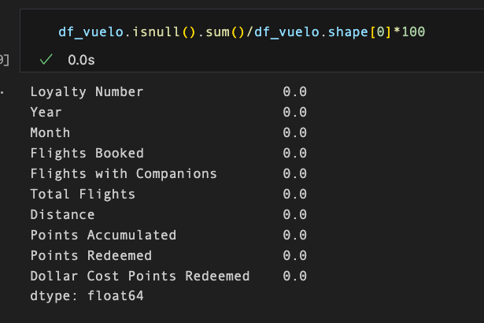

No obstante, sí tenemos muchos "0". Como son todas las columnas numéricas, estos ceros podrían significar o bien que ese dato == 0 o bien que no se dispone de ese dato (==Dato nulo). Vamos a investigar cuántos "0" tienen las columnas:

```python
df_vuelo['Total Flights'].value_counts().sort_values(ascending=False)

#pongo ascending=False porque el 0 es el que más frecuencia tiene y así me sale primero.
```

Lista de columnas que comparten número de datos == 0:

- 197992 datos == "0". Posible relación porque si no has viajado, no has realizado reservas y no tienes puntos acumulados.
    - `Total Flights`
    - `Flights Booked`
    - `Points Accumulated`


- 381443 datos == "0":
    - `Points Redeemed`: los valores únicos siguen el siguiente rango: 447 a 876.

    - `Dollar Cost Points Redeemed`:  Parece que cuando  == 0, se corresponde a los puntos canjeados (se han canjeado 0 ptos).

- 296887 == "0":
    - `Flights with Companions`: rango de datos desde 1 a 11 personas como acompañantes.


### 1.3. Análisis duplicados en `df_vuelo`:
Eliminamos los duplicados de filas:

```python
#Observamos si hay duplicados:

df_vuelo[df_vuelo.duplicated(subset='Loyalty Number',keep=False)]

#output: 3712 rows × 10 columns
```
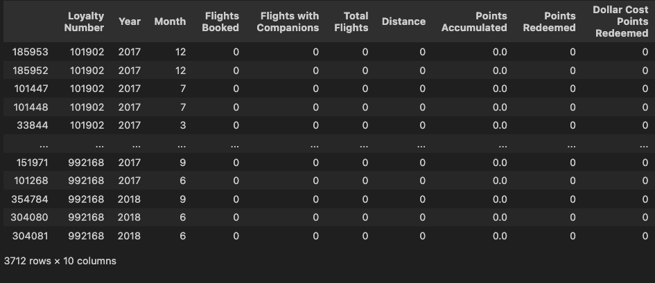


Parece que hay 3712 /  2 duplicados = `1856` ==> los eliminamos.


`OJO!`👀
Tras hacer todos estos cambios, nos damos cuenta de que parece que podríamos agrupar por cliente (Loyalty Number), Year y Month,  porque todas las filas podrían sumarse:

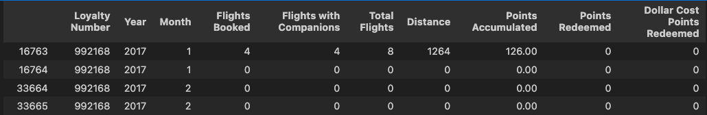

--> lo hacemos:
```python
df_vuelo_reducido = 
df_vuelo.groupby(['Loyalty Number', 'Year', 'Month'])[['Flights Booked','Flights with Companions', 'Total Flights', 'Distance','Points Accumulated', 'Points Redeemed', 'Dollar Cost Points Redeemed']].sum().reset_index()
```
--> reducimos 2072 filas


### 1.4. Estadísticas básicas iniciales `df_vuelos`:
Cogemos sólo las columnas que nos interesan (dejo fuera de momento las fechas y el Loyalty number):

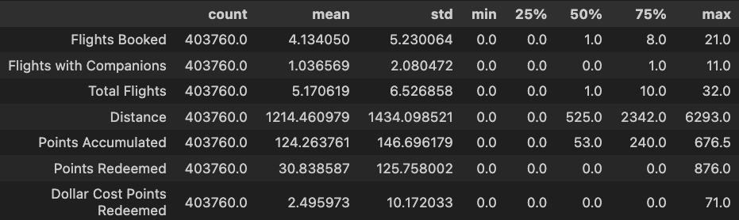

Ya veremos más adelante, pero por lo general, parece que:
-  la mitad de las reservas que se realizan, son sólo de un vuelo, 
- suelen volar solos (más de la mitad vuelan solos) 
- Vistas las estadísticas anteriores, más de la mitad, no suelen gastar puntos (tampoco acumulan demasiados porque los clientes hacen de media sólo 1 reserva).


# 2. Información sobre el perfil detallado de los clientes `df_cliente`:

### 2.1. Situación inicial, tipos de datos `df_cliente`:
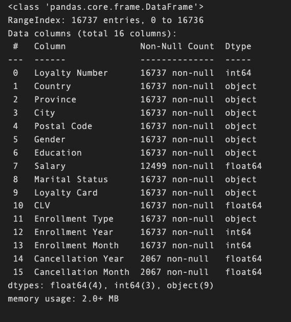

- `Loyalty Number`: ok, int64

- `Country`, `Province`,`City`, `Postal Code` : object, ok. Todos nuestros clientes vienen de Canada.

- `Gender`: object, ok. Unique: ['Female', 'Male'].

- `Education`: object, ok. Unique: ['Bachelor', 'College', 'Master', 'High School or Below', 'Doctor']

- `Salary`: float64, OJO hay salarios negativos, que he visto en las estadísticas el valor mínimo:

```python

df_cliente[df_cliente['Salary'] < 0].shape
#output: (20,16) 
#--> hay 20 salarios negativos... 
# Consultar con la empresa si esto puede ser un error y haya que ponerlos todos en valor absoluto, y en caso afirmativo, cambiarlo a valor absoluto.

```


- `Marital Status`: object, ok. Unique: ['Married', 'Divorced', 'Single']

- `Loyalty Card`: object, ok. Unique: ['Star', 'Aurora', 'Nova'] #niveles de categoría dentro del programa de lealtad

- `CLV` (Customer Lifetime Value): float64. Valor que el cliente aporta a la empresa. *Parece una columna interesante para las estadísticas!*

- `Enrollment Type`: object. Tipo de inscripción del cliente, unique: ['Standard', '2018 Promotion']

- `Enrollment Year`, `Enrollment Month` : int64, todo ok.

- `Cancellation Year`, `Cancellation Month`: float64. Cambiar a tipo int64 para que sea fecha.


### 2.2. Situacion inicial nulos (en %) `df_cliente`:

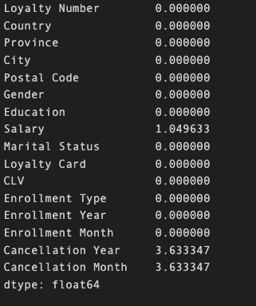
- `Salary`: en principio, hay pocos nulos, lo dejaremos así porque no es representativo. De momento lo dejamos así.

- `Cancellation Year`, `Cancellation Month`: Pocos nulos, pero cuando lo mergeemos se van a hacer más numerosos, porque puede que haya varias lineas por cada cliente. Confirmaremos con la empresa pero entiendo que estos 0 no es un valor nulo, si no que es que todavía siguen siendo miembros del programa de lealtad. En tal caso, intentaremos cambiar los nulos por "0", para que no sean un float y así que estas dos columnas sean int64.


### 2.3. Análisis duplicados `df_cliente`:
No hay duplicados en este df.

### 2.4 Estadísticas iniciales básicas `df_cliente`:

Conclusiones iniciales, a profundizar:

#### Variables categóricas `df_cliente`:

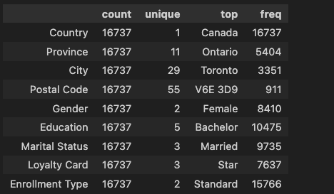

- todos los clientes son de Canadá y la ciudad más frecuente es Toronto.

- Podría ser interesante analizar el código Postal "V6E 3D9". Incluirlo como Next Steps para una posible campaña publicitaria.

- Las mujeres son más frecuentes que los hombres.

- Los clientes más frecuentes: casados, con licenciatura, con tarjeta Loyalty Star y programa Standard.

#### Variables numéricas `df_cliente`:

Seleccionamos Salary y CLV y las que tienen meses y años (aunque los meses y años todavía tengamos que transformarlos). Así podemos ver si hay algo raro:

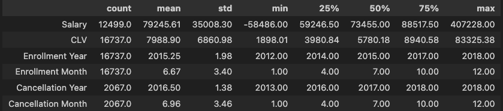

- `Salary`: hay salarios negativos... los pasamos a valor absoluto en la limpieza.

- `CLV` (valor cliente para la empresa): en principio, por la desviación típica, parece que hay mucha dispersión en este dato.. La media y la mediana están muy alejadas.


# 3. Información tras el MERGE `df`:


### 3.1. Situacion tipo de datos `df`:

`Datos numéricos`:

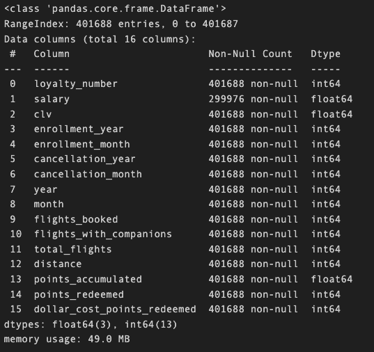

- ya hemos cambiado `Cancellation Year`, `Cancellation Month` a int 64.

- Tenemos que pasar `salary` a valores absolutos.

`Datos objeto`:

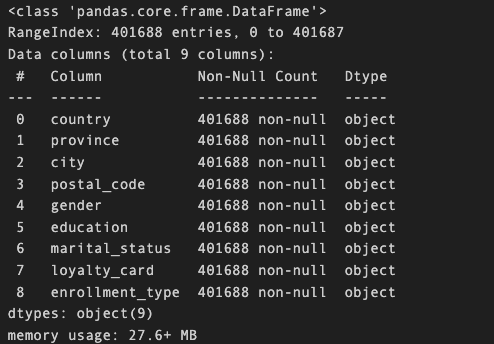

Me parece que está todo ok.

### 3.2. Situacion duplicados `df`:
No hay.

### 3.3. Situacion nulos (en %) `df`:

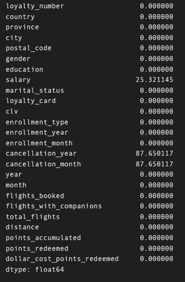

- `salary`: tiene 25% nulos. ¿qué podemos hacer? 
    - Parece que no podemos hacer nada. He revisado si algún cliente podría tener dato en otra fila pero no es así. 
    - Posible relación con columnas `educación` y `gender`: la columna `salary` tiene mucha correlación con `education` (0.62), no así con `gender`. No obstante, la correlación con `education` no se acerca lo suficiente al 1 como para imputar los nulos. No imputamos los nulos.

- `Cancellation Year`, `Cancellation Month`: Tras el merge, tenemos estas filas de clientes duplicadas porque necesitamos rellenar los vuelos asignados a ese cliente, por eso ha aumentado el número de nulos:

    - Hemos eliminado los nulos igualando el dato a cero, interpretando que si no había dato significaba que todavía seguían en este programa de lealtad.

    -  Hemos creado una columna una columna que se llama `still_client_loyalty` y que sea un booleano: SI o NO. Los 0 de la columna `Cancelation` significarán que todavía siguen siendo miembros del programa lealtad, y los que tienen fecha de cancelación, serán los que ya no forman parte del plan.

Análisis nueva columna `still_client_loyalty`:
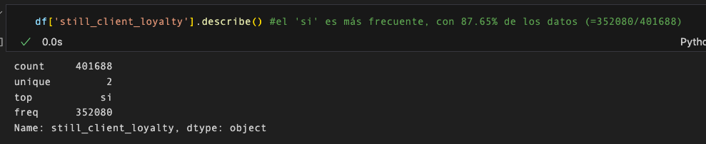

--> el 'si' es más frecuente, con 87.65% de los datos (=352080/401688)


### 3.4. Estadísticas básicas completas `df`:

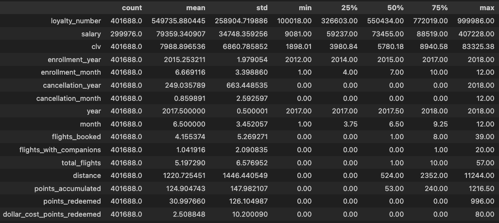

#### Numéricas:
- Lo más frecuente es que los clientes reserven 1 vuelo en su experiencia de cliente con la aerolínea (la media no es del todo fiable porque hay algunos clientes que viajan mucho ellos solos y viajan mucho con tras personas)

- La distancia media recorrida por los clientes es 1220.72 millas, no obstante, como hemos comentado, no es representativo porque los clientes viajan mucho y viajan mucho acompañados. La distancia qus se encuentra en el centro de nuestros datos es: 524.00 millas.

- Muy pocos clientes  utilizan los puntos del programa de lealtad (menos de un 25%) 

- El salario medio de los clientes está en torno a los 79.359 dólares.


#### Categóricas:

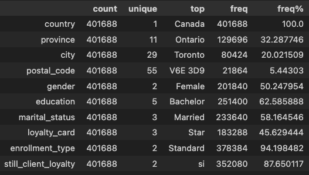

- La ciudad, provincia y postal code más frecuentes de la que provienen nuestros clientes es `Toronto`, `Ontario` y `V6E 3D9`.

- la mayor parte de los clientes analizados (87%) siguen siendo clientes de la compañía.

- No es relevante el `género` en la condición de cliente.

- la mayor parte de los clientes están `Married`.


