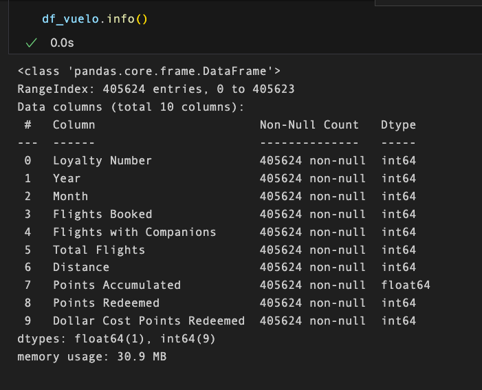

# EDA:

## 1. Información sobre la actividad de vuelo de los clientes `df_vuelo`:

### 1.1. Situación inicial, tipos de datos:




- `Loyalty Number`: int64, todo ok aparentemente.

- `year`: columna int64 y podría ser de tipo datatime. Posibilidad de juntar con `month`

- `month`: int64 y podría ser de tipo datatime, juntar cno `year`.

- `flights booked`,`Flights with Companions`, `Total Flights`,`Distance`, `Points Redeemed`: todo ok a priori, son int64.

- `Points Accumulated`: float64. Hay clientes que tienen por ejemplo, "474.12" puntos.

- `Dollar Cost Points Redeemed`:  int64

### 1.2. Situacion inicial nulos (%):


No obstante, sí tenemos muchos "0". Como son todas las columnas numéricas, estos ceros podrían significar o bien que ese dato == 0 o bien que no se dispone de ese dato (==Dato nulo). Vamos a investigar cuántos "0" tienen las columnas:

```python
df_vuelo['Total Flights'].value_counts().sort_values(ascending=False)

#pongo ascending=False porque de esta forma me sale siempre el 0 el primero, porque es el que más registros tiene.
```

Lista de columnas que comparten número de datos == 0:

- 197992 datos == "0". Posible relación porque si no has viajado, no has realizado reservas y no tienes puntos acumulados.
    - `Total Flights`
    - `Flights Booked`
    - `Points Accumulated`


- 381443 datos == "0":
    - `Points Redeemed`: los valores únicos siguen el siguiente rango: 447 a 876. Hay 381443 "0".

    - `Dollar Cost Points Redeemed`: al igual que la columna anterior, tiene 381443 "0", correspondiente a los puntos canjeados == 0, es decir, que se han canjeado 0 ptos.

- 296887 == "0":
    - `Flights with Companions`: rango de datos desde 1 a 11 personas como acompañantes.


### 1.3. Análisis duplicados:
Eliminamos los duplicados de filas:

```python
#Observo a ver si hay duplicados:

df_vuelo[df_vuelo.duplicated(subset='Loyalty Number',keep=False)]

#output: 3712 rows × 10 columns
```


Parece que hay 3712 /  2 duplicados = `1856` ==> los eliminamos.

### 1.4. Estadísticas básicas iniciales:
Cogemos sólo las columnas que nos interesan (dejo fuera de momento las fehcas y el Loyalty number):


Ya veremos más adelante, pero parece que por lo general, parece que:
-  la mitad de los clientes tienen un sólo vuelo realizado con la compañía, 
- suelen volar solos (más de la mitad vuelan solos) y 
- Vistas las estadísticas anteriores, más de la mitad, no suelen gastar puntos (tampoco acumulan demasiados).


## 2. Información sobre la actividad de vuelo de los clientes `df_cliente`:

### 2.1. Situación inicial, tipos de datos:


- `Loyalty Number`: ok, int64

- `Country`, `Province`,`City`, `Postal Code` : object, ok

- `Gender`: object, ok. Unique: ['Female', 'Male'].

- `Education`: object, ok. Unique: ['Bachelor', 'College', 'Master', 'High School or Below', 'Doctor']

- `Salary`: float64, OJO hay salarios negativos, que he visto en las estadísticas el min:

```python
df_cliente[df_cliente['Salary'] < 0].shape

#(20,16) --> hay 20 salarios negativos... Consultar con la empresa si esto puede ser un error y haya que ponerlos todos en valor absoluto, y en caso afirmativo, cambiarlo a valor absoluto.
```


- `Marital Status`: object, ok. Unique: ['Married', 'Divorced', 'Single']

- `Loyalty Card`: object, ok. Unique: ['Star', 'Aurora', 'Nova'] #niveles de categoría dentro del programa de lealtad

- `CLV` (Customer Lifetime Value): float64. Valor que el cliente aporta a la empresa. *Parece una columna interesante para las estadísticas!*

- `Enrollment Type`: object. Tipo de inscripción del cliente, unique: ['Standard', '2018 Promotion']

- `Enrollment Year`, `Enrollment Month` : int64. Cambiar a tipo datetime.

- `Cancellation Year`, `Cancellation Month`: float64. Cambiar a tipo datetime.


### 2.2. Situacion inicial nulos (en %):


- `Salary`: en principio, hay muy pocos nulos, lo dejaremos así porque no es representativo. Se podría hacer una imputación, pero no afectaría demasiado a la población porque es muy pequeño porcentaje. Se pueden sacar conclusiones robustas con ese % de nulos.


### 2.3. Análisis duplicados:
No hay duplicados en este df.

### 2.4 Estadísticas iniciales básicas:

Conclusiones iniciales, a profundizar:

#### Variables categóricas:


- todos los clientes son de Canadá y la ciudad más frecuente es Toronto.

- Podría ser interesante analizar el código Postal "V6E 3D9" e incluso incluirlo como Next Steps para una posible campaña publicitaria.

- Las mujeres son más frecuentes que los hombres.

- Los clientes más frecuentes: casados, con licenciatura, con tarjeta Loyalty Star y programa Standard.

#### Variables numéricas:

Seleccionamos sólo Salary y CLV porque los meses todavía no nos dicen gran cosa, todavía tenemos que transformarlos:


- `Salary`: hay salarios negativos... Ver arriba en la variable.

- `CLV` (valor cliente para la empresa): en principio, por la desviación típica, parece que hay mucha dispersión en este dato.. La media y la mediana están muy alejadas.

